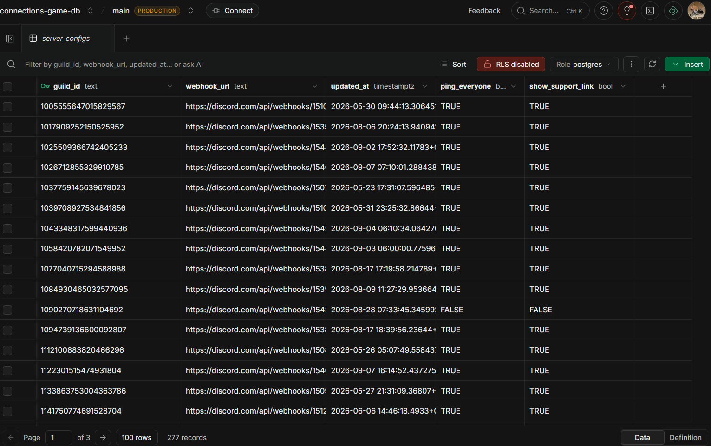
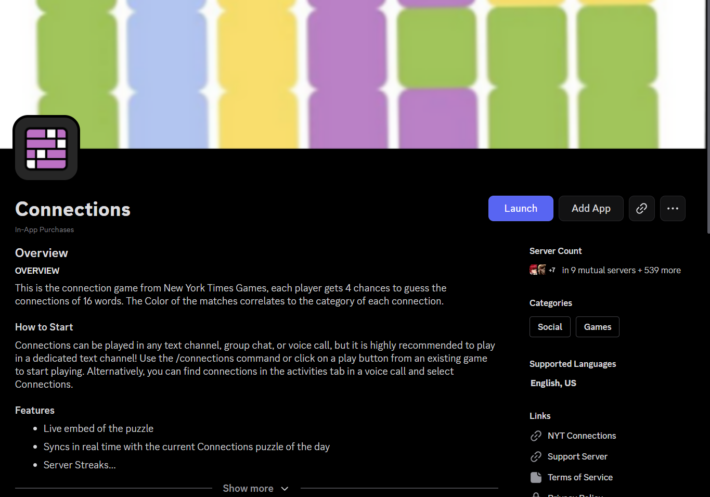

There is another known bug with the connections game where users will have to authenticate multiple times

# How to Recreate the Bug
* The bug can occur on any device, mobile or pc
* Open the discord app using any account and run /connections
* Launch the game
* Leave the game
* Launch the game a 2nd time
* Authentication will launch multiple times, sometimes requiring a captcha

## Users Affected
Any user that has made multiple attempts on the daily puzzle or has attempted to reset it will be affected by this bug. It does not affect gameplay in any case and is just a minor annoyance to the users.

### How to Resolve
The bug fixes itself client side after the daily puzzle refreshes. On the server side, it may be fixable if I can reduce the number of requests made between Supabase and discord.

Above is the supabase data for server configs, controlling which servers have the game set up.

#### See Also
[[Save State Bug]]

