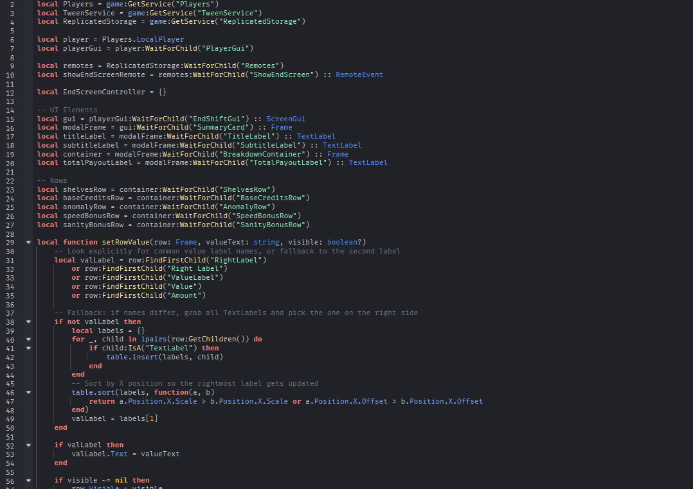

In a game I am currently developing, there is a bug where the end state is affected by players respawning.

# How to Recreate the Bug
* Go to roblox studio and run the place
* Reset your character from the menu
* The end game UI should appear, but then promptly disappear about 10 seconds after you respawn.

## Severity
This bug is one of my top priorities due to its severity, as the game loop cannot be completed if the character respawns at the end of the game. If the character respawns it should take them back to the lobby map, but it does not due to the lack of end game UI shortly after respawning.

### How to Resolve
This bug is entirely server sided and located in one of my server scripts handling the end game state, I will be fixing this bug by simply turning off the ability to respawn for all players.

Above is my script that controls the end screen, the error is likely found within this script due to a lack of instructions on if a player respawns.

#### See Also

[[Pathfinding Bug]]
